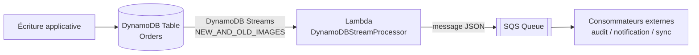

# DynamoDB Streams CDC Pipeline

[](https://github.com/Julionores/dynamodb-streams-cdc-pipeline/actions/workflows/ci.yml)

Une pipeline de **Change Data Capture (CDC)** sur Amazon DynamoDB : chaque écriture
(insertion, modification, suppression) sur une table est capturée en temps réel par
**DynamoDB Streams**, traitée par une fonction **Lambda**, et republiée sous forme de
message dans une file **SQS** — un pattern courant pour découpler une base de données
transactionnelle des systèmes qui doivent réagir à ses changements (audit, notification,
synchronisation d'un autre système, alimentation d'un entrepôt de données).

> Projet réalisé par **Junior Tsafack Megnekeu** ([blog.jtmcloud.com](https://blog.jtmcloud.com) ·
> [GitHub](https://github.com/Julionores) ·
> [LinkedIn](https://www.linkedin.com/in/junior-tsafack-megnekeu-b673151b9)) — pièce d'un
> portfolio technique orienté Cloud/DevOps. Voir aussi
> [`aws-troubleshooting-challenge`](https://github.com/Julionores/aws-troubleshooting-challenge),
> [`s3-cross-region-replication`](https://github.com/Julionores/s3-cross-region-replication),
> [`aws-alb-deployment-patterns`](https://github.com/Julionores/aws-alb-deployment-patterns) et
> [`aws-vpc-connectivity-patterns`](https://github.com/Julionores/aws-vpc-connectivity-patterns).
> Côté DevSecOps/Full Stack, voir aussi
> [`devsecops-pipeline-reference`](https://github.com/Julionores/devsecops-pipeline-reference),
> [`securebank-api`](https://github.com/Julionores/securebank-api),
> [`postgresql-ha-repmgr`](https://github.com/Julionores/postgresql-ha-repmgr) et
> [`iso27001-isms-toolkit`](https://github.com/Julionores/iso27001-isms-toolkit).

## Architecture



Le déclencheur (`AWS::Lambda::EventSourceMapping`) fait sondre en continu le flux DynamoDB ;
chaque enregistrement modifié déclenche la Lambda, qui publie un message structuré
(`eventName`, `newImage`, `oldImage`) dans SQS.

## Structure du dépôt

```
cloudformation/template.yaml   # Table DynamoDB + Streams + rôle IAM + Lambda + EventSourceMapping + SQS
src/handler.py                 # Copie autonome du code Lambda (pour les tests -- voir plus bas)
tests/
├── test_handler.py            # Tests unitaires de la logique de traitement
└── test_template_sync.py      # Empêche la dérive entre le template et src/handler.py
```

Le code Lambda est déployé **inline** dans le template CloudFormation (pas de dépendance à
S3 ou à un outil de packaging) ; `src/handler.py` en est une copie exacte, maintenue
uniquement pour permettre des tests unitaires classiques. `test_template_sync.py` compare
les deux mot pour mot à chaque exécution de la CI : toute divergence fait échouer les tests.

## Vérification réelle (pas seulement statique)

Ce template a été **déployé sur un compte AWS réel** (région `eu-west-1`) et testé de bout
en bout avant publication :

1. Déploiement de la stack (`aws cloudformation deploy`).
2. Insertion d'un item dans la table DynamoDB (`aws dynamodb put-item`).
3. Réception, dans la file SQS, du message suivant, produit par la Lambda :

   ```json
   {
     "eventName": "INSERT",
     "newImage": {
       "Status": {"S": "NEW"},
       "Amount": {"N": "17.9"},
       "OrderID": {"S": "order-002"}
     },
     "oldImage": {}
   }
   ```

4. Suppression de la stack (`aws cloudformation delete-stack`) — aucune ressource ne reste
   active après le test.

## Déploiement

```bash
aws cloudformation deploy \
  --template-file cloudformation/template.yaml \
  --stack-name cdc-demo \
  --capabilities CAPABILITY_IAM \
  --region eu-west-1
```

Récupérer les sorties (nom de la table, URL de la file, nom de la fonction) :

```bash
aws cloudformation describe-stacks --stack-name cdc-demo --query "Stacks[0].Outputs"
```

Tester manuellement :

```bash
aws dynamodb put-item --table-name <OrdersTableName> \
  --item '{"OrderID": {"S": "order-001"}, "Status": {"S": "NEW"}, "Amount": {"N": "42.50"}}'

aws sqs receive-message --queue-url <SQSQueueURL> --wait-time-seconds 10
```

Nettoyer :

```bash
aws cloudformation delete-stack --stack-name cdc-demo
```

## Développement local

```bash
python -m venv .venv
source .venv/Scripts/activate   # ou .venv/bin/activate sous Linux/macOS
pip install -r requirements-dev.txt
pytest -v
cfn-lint cloudformation/template.yaml
```

## Limites assumées

- `BillingMode: PAY_PER_REQUEST` sur la table DynamoDB : pas de dimensionnement de capacité à
  gérer, adapté à une démo, à réévaluer pour un trafic élevé et prévisible.
- Aucune politique de nouvelle tentative (DLQ) n'est configurée sur la file SQS : en usage
  réel, une file de lettres mortes (dead-letter queue) éviterait de perdre un message en cas
  d'échec de traitement par le consommateur final.
- Le déclencheur utilise `StartingPosition: LATEST` : les écritures survenues avant
  l'activation du mapping ne sont pas rejouées (comportement voulu pour une pipeline de flux
  continu, à adapter si un rattrapage historique est nécessaire).

## Licence

MIT — voir [`LICENSE`](LICENSE). Projet à but pédagogique et de démonstration.
